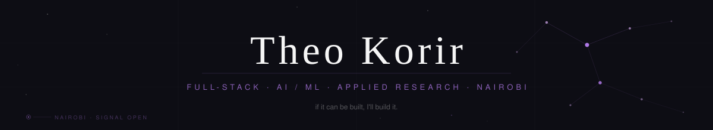

> I build things end-to-end: ML pipelines, Android automations, Android apps, production APIs, web apps. 
> Speech models fine-tuned in PyTorch. Platforms shipped solo. Pipelines running on nothing but a phone.

---

## Current Research

| Project | Description |
|---|---|
| **WavLM Emotion Recognition** | Fine-tuning Microsoft WavLM Base for 8-class emotion recognition across RAVDESS, IEMOCAP, and CREMA-D. Full pipeline: data loading, augmentation, evaluation, checkpoint management. 77.3% in-distribution accuracy; cross-corpus gap diagnosed via arousal/valence analysis. |
| **Kenyan Audio Corpus (DAPT)** | Curating a Kenya-specific audio dataset for domain-adaptive pre-training — deduplication, quality filtering, preprocessing — informed by *Don't Stop Pre-Training*. |

---

## Projects

### [Churn Escalation Detector — End-to-End MLOps Pipeline](https://github.com/spacey-cadet/churn-escalation)
Churn-risk scoring pipeline that runs unchanged in two deployment modes — local Docker/SQLite and AWS Lambda/DynamoDB/S3 — with identical training, gating, and serving code across both. Two-stage ETL data-quality gates (ingestion + transformation) block the pipeline and fire Slack/Discord alerts on failure. XGBoost model with Platt calibration and two independently-tuned cascade thresholds routes predictions into auto-resolve / review-queue / senior-escalation tiers. Champion-challenger promotion gate blocks any retrain that regresses PR-AUC on held-out or stress-test slices, backed by a versioned model registry with JSON model cards. Feature store with true point-in-time joins, an hourly drift monitor (KS test + PSI), and a 21-day label-delay backfill job that recomputes precision/recall/F1 once ground truth lands. CI/CD via GitHub Actions with OIDC (no long-lived AWS keys) and canary rollouts via hashed customer routing.

`Python` `XGBoost` `FastAPI` `Docker` `AWS Lambda` `DynamoDB` `S3` `GitHub Actions`

---

### [Click-Fraud & Churn Risk Scoring Platform (ad-platform-ml)](https://github.com/spacey-cadet/ad-fraud)
Two real-time scoring services — click-fraud detection and churn prediction — sharing a common feature base, deployable as either a free local Docker stack or a serverless AWS stack under a shared ~$15/month budget. Streaming feature pipeline (Redpanda + Faust locally; SQS → aggregator Lambda → DynamoDB in production) computes rolling click-count windows per user for real-time fraud scoring. AWS path provisioned entirely with Terraform — Lambda container images, DynamoDB, SQS + DLQ, SNS alerting, CloudWatch alarms/dashboards, GitHub OIDC deploy role — deliberately avoiding always-on services to stay within budget. Experiments tracked with MLflow; every local-vs-cloud architecture trade-off documented in an ADR.

`Python` `LightGBM` `Redis/Feast` `Redpanda/Faust` `SQS` `DynamoDB` `Terraform` `Docker` `MLflow`

---

### [Scoopz](https://github.com/spacey-cadet/scoopz)
End-to-end TikTok automation pipeline running entirely on a phone via Termux. Watches a link inbox, downloads videos in HD, extracts frames with `ffmpeg`, and generates captions via GPT-4o Vision. Async 5-worker pipeline with parallel captioning across 3 concurrent workers. FastAPI control layer for job orchestration, retry logic, and per-worker failure isolation.

**Impact:** ~58% faster content processing (2 hrs → 50 min for 40 videos), fully hands-off.

`Python` `Kotlin` `Android` `FastAPI` `OpenAI API` `ffmpeg` `Termux`

---

### [AI Workflow Pipeline Builder](https://github.com/spacey-cadet)
Visual, node-based engine for building and validating AI pipelines with real-time execution. Started as a static ReactFlow demo; now runs on 9 modular node types (LLM, API Call, Vector Store, Conditional, etc.) built on a reusable BaseNode architecture. Regex-driven variable parsing (`{{ variables }}`) auto-generates graph connections. FastAPI backend validates DAG integrity via Kahn's Algorithm before execution.

`React` `ReactFlow` `FastAPI` `Python` `DAG Algorithms`

---

### [Speech Emotion Recognition — WavLM Fine-Tuning](https://github.com/spacey-cadet)
Fine-tuned a 24-layer Transformer for 8-class emotion recognition across RAVDESS, IEMOCAP, and CREMA-D. 77.3% accuracy in-distribution; cross-corpus testing exposed a 16–23pp generalisation drop, diagnosed via arousal/valence failure analysis — a known limit of self-supervised speech embeddings. Scoped fixes: adversarial domain adaptation, speaker disentanglement, Kenya-specific DAPT corpus.

`PyTorch` `HuggingFace` `WavLM` `SpeechBrain` `Transfer Learning`

---

### [WavLM SER — Production Inference Pipeline (Deployment)](https://github.com/spacey-cadet/ser-inference)
Rebuilt a single-endpoint inference demo into a production-grade serving pipeline (FastAPI + Docker on HuggingFace Spaces) covering calibration, drift monitoring, rollout, and latency — running entirely on free-tier infrastructure. Offline-fit Platt/isotonic calibration and a two-threshold confidence cascade let uncertain predictions degrade gracefully instead of returning an overconfident wrong label. Input-validation and voice-activity-trimming gates feed a consent-gated feature-logging pipeline into a KS-test drift monitor and a low-confidence review/labeling queue. In-process champion/challenger canary routing, evaluated offline on PR-AUC and per-class F1 before any rollout. p50/p99 latency tracked per request and gated on release; testing and promotion automated via GitHub Actions.

`FastAPI` `Docker` `HuggingFace Spaces` `GitHub Actions` `Great Expectations`

---

### Pay Hero &nbsp;·&nbsp; *1st Place, Kenya Buildathon 2024*
Scalable B2B communication platform helping businesses engage customers at scale. Shipped under hackathon time pressure with a 2-person team, full-stack, and won against the full field.

`Scalable Architecture` `B2B` `Rapid Deployment` `Full-Stack`

---

### Production Web Platforms
Three production platforms — full lifecycle ownership, architecture to deployment to support.

| Platform | Description |
|---|---|
| **[Lisa Luxury Homes](https://lisaluxuryhomes.co.ke)** | Real-estate platform with dynamic routing, SEO optimisation, and WhatsApp conversion flow. |
| **[FunFiesta Kenya](https://funfiestakenya.com)** | Booking platform for a kids' events business. Mobile-first, end-to-end. |
| **[Rafi](https://rafi.co.ke)** | Student mental-health platform: wellbeing tracking, risk detection, counsellor routing. |

`Next.js` `React` `Node.js` `REST APIs` `Vercel` `SEO`

---

## Stack

**AI / ML**&nbsp;&nbsp;

 
**Classical ML**&nbsp;&nbsp;

**Languages**&nbsp;&nbsp;

**Frontend**&nbsp;&nbsp;

**Backend**&nbsp;&nbsp;

**Mobile & DevOps**&nbsp;&nbsp;

---

## Experience

**Machine Learning Engineer Intern · JHUB Africa** &nbsp;·&nbsp; *May – Aug 2024*
- Integrated ML models into production systems (React + FastAPI), owning the connection between model outputs and the UI.
- Designed RESTful APIs bridging backend inference pipelines with frontend components.
- Reviewed code and presented technical work to non-technical stakeholders on an async, remote-distributed team.

**Full-Stack Developer · Independent Clients (Freelance)** &nbsp;·&nbsp; *2024 – 2025*
- Architected, deployed, and maintained 3 production web applications solo, 100% on-time delivery.
- Owned the full workflow: REST API design, version control, Vercel deployment, SEO, post-launch support.

---

## Education

**BSc Computer Science** — Jomo Kenyatta University of Agriculture & Technology *(Expected 2026)*
Data Structures & Algorithms · Artificial Intelligence · Operating Systems · System Design · OOP · Cryptography · Probability & Statistics · Internet Application Programming

---

## Contact

&nbsp;

&nbsp;

&nbsp;

---

 
Nairobi, Kenya

